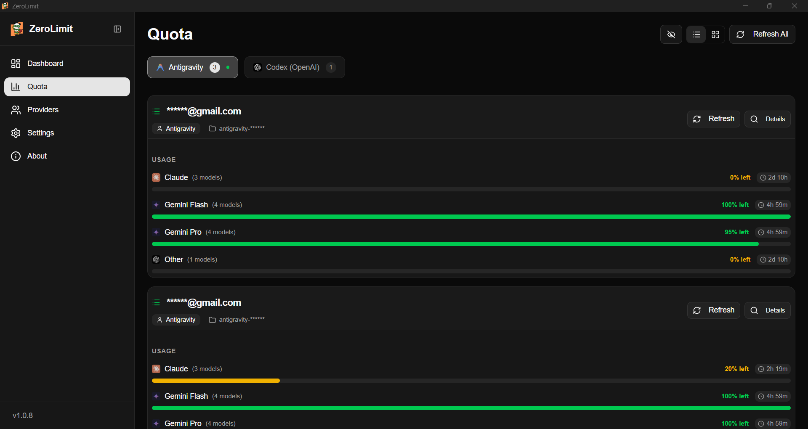
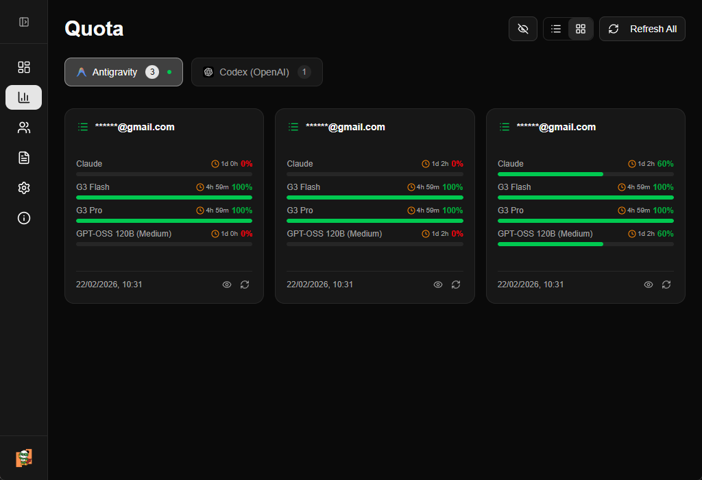
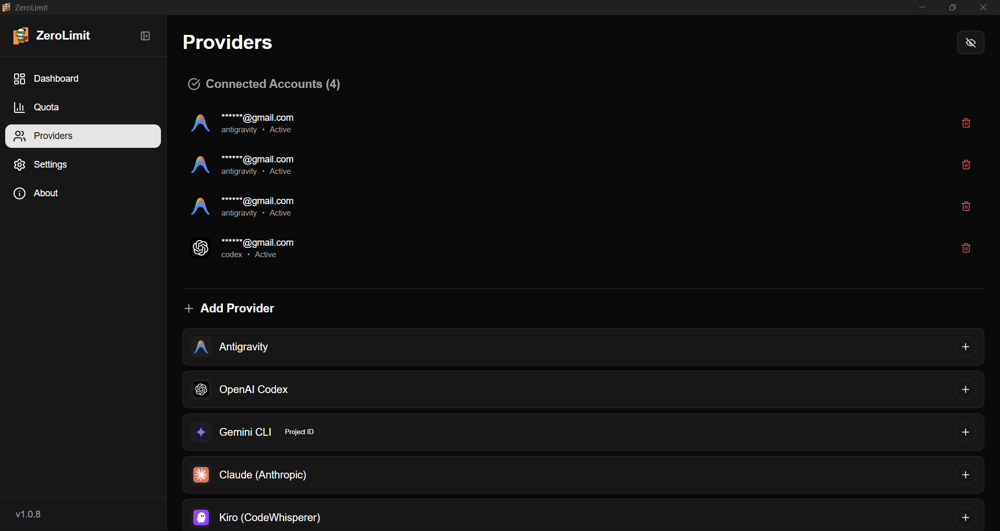
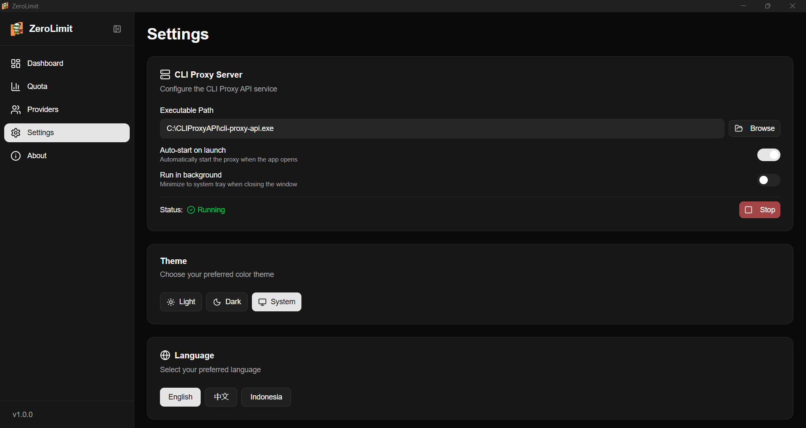

# ZeroLimit

<p align="center">

<br />
A Tauri-based alternative to Quotio for Windows
</p>

<p align="center">
  
  
  
</p>

---

## 🎯 What is ZeroLimit?

ZeroLimit is a **lightweight Windows desktop application** for monitoring AI coding assistant quotas. Track your usage across Antigravity, Anthropic Claude, Codex (OpenAI), and Gemini CLI accounts in one dashboard.

Unlike [Quotio](https://github.com/nguyenphutrong/quotio) (macOS-only, Swift), ZeroLimit is built with **Tauri + React + Rust** and runs on **Windows**.


## 🚀 Key Features

- 🔌 **Multi-Provider Support** - Monitor Gemini, Claude, OpenAI, Antigravity accounts
- 📊 **Real-time Quota Dashboard** - Track usage per account with visual progress bars
- 🖥️ **System Tray Integration** - Quick access from your taskbar
- ⚡ **One-Click Proxy Control** - Start/stop CLIProxyAPI with a single click
- 🔄 **Auto-start on Launch** - Optionally start the proxy when the app opens
- 🌓 **Dark/Light Theme** - Beautiful UI with theme support
- 🌍 **Multilingual** - English, Chinese, Indonesian

## 🤖 Supported Ecosystem

| Provider | Auth Method |
|----------|-------------|
| Google Gemini | OAuth |
| Anthropic Claude | OAuth |
| OpenAI Codex | OAuth |
| Antigravity | OAuth |

## 📦 Installation

### Windows
Download from [Releases](https://github.com/0xtbug/zero-limit/releases):
- `ZeroLimit_x.x.x_x64-setup.exe` (NSIS installer)
- `ZeroLimit_x.x.x_x64_en-US.msi` (MSI installer)

### Building from Source

```bash
# Clone repository
git clone https://github.com/0xtbug/zero-limit.git
cd zero-limit

# Install dependencies
pnpm install

# Development
pnpm run tauri dev

# Production build
pnpm run tauri build
```
## 📸 Screenshots

### Dashboard


### Quota Monitoring




### Providers



### Settings



## 📖 Documentation

- [Usage Guide](docs/USAGE.md)

## 🤝 Contributing

1. Fork the Project
2. Create your Feature Branch (git checkout -b feature/new-feature)
3. Commit your Changes (git commit -m 'Add new feature')
4. Push to the Branch (git push origin feature/new-feature)
5. Open a Pull Request

## 📄 License

MIT License - see [LICENSE](LICENSE) for details.

---

<p align="center">
  Made with ❤️ using Tauri + React
</p>
