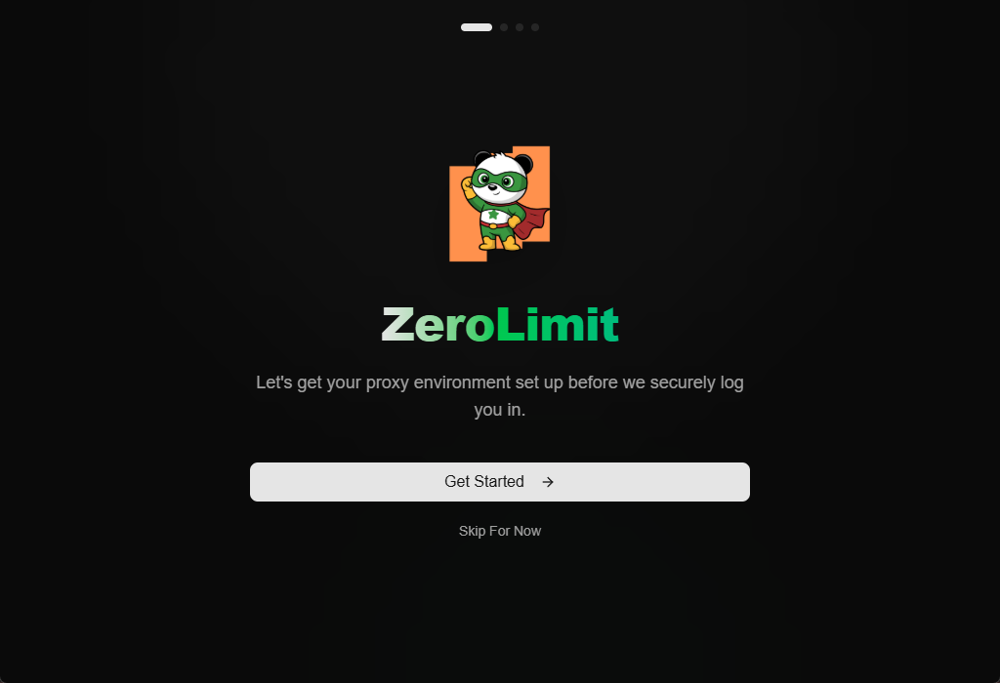

# ZeroLimit

<p align="center">

<br />
A cross-platform AI coding assistant quota tracker
</p>


<p align="center">
  
  
  
</p>

---

## 🎯 What is ZeroLimit?

ZeroLimit is a **cross-platform desktop application** for monitoring AI coding assistant quotas using [CLIProxyAPI](https://github.com/router-for-me/CLIProxyAPI). Track your usage across Antigravity, Anthropic Claude, Codex (OpenAI), Gemini CLI, Kiro, and GitHub Copilot accounts in one dashboard.

Built with **Tauri + React + Rust**, ZeroLimit runs on **Windows**, **macOS**, and **Linux**.

## 🚀 Key Features

- 🔌 **Multi-Provider Support** - Monitor Gemini, Claude, OpenAI, Antigravity, Kiro, and Copilot accounts
- 📊 **Real-time Quota Dashboard** - Track usage per account with visual progress bars
- 🖥️ **System Tray Integration** - Quick access from your taskbar
- ⚡ **One-Click Proxy Control** - Start/stop CLIProxyAPI with a single click
- 🔄 **Auto-start on Launch** - Optionally start the proxy when the app opens
- 🌓 **Dark/Light Theme** - Beautiful UI with theme support
- 🌍 **Multilingual** - English, Chinese, Indonesian, Japanese, Korean, Vietnamese, Thai
- 🔄 **Auto-update** - Automatically check for updates and install them

## 🤖 Supported Ecosystem

| Provider | Auth Method |
|----------|-------------|
| Google Gemini | OAuth |
| Anthropic Claude | OAuth |
| OpenAI Codex | OAuth |
| Antigravity | OAuth |
| Kiro | OAuth |
| Github Copilot | OAuth |

## 📦 Installation

### Windows
Download from [Releases](https://github.com/0xtbug/zero-limit/releases):
- `ZeroLimit_x.x.x_x64-setup.exe` - NSIS installer (x64)
- `ZeroLimit_x.x.x_arm64-setup.exe` - NSIS installer (ARM64)
- `ZeroLimit_x.x.x_x64_en-US.msi` - MSI installer (x64)
- `ZeroLimit_x.x.x_portable.exe` - Portable executable

### macOS
Download from [Releases](https://github.com/0xtbug/zero-limit/releases):
- `ZeroLimit_x.x.x_aarch64.dmg` - Apple Silicon (M1/M2/M3)
- `ZeroLimit_x.x.x_x64.dmg` - Intel

> ⚠️ **Note**: The app is not signed with an Apple Developer certificate. If macOS blocks the app, run:
> ```bash
> xattr -cr /Applications/ZeroLimit.app
> ```

### Linux
Download from [Releases](https://github.com/0xtbug/zero-limit/releases):
- `.deb` - Debian/Ubuntu
- `.rpm` - Fedora/RHEL
- `.AppImage` - Universal

### Building from Source

```bash
# Clone repository
git clone https://github.com/0xtbug/zero-limit.git
cd zero-limit

# Install dependencies
pnpm install

# Development
pnpm run tauri dev

# Production build
pnpm run tauri build
```

## 📸 Screenshots

### Onboarding



### Dashboard


### Quota Monitoring


### Providers


### Settings


## 📖 Documentation

- [Usage Guide](docs/USAGE.md)

## 🤝 Contributing

1. Fork the Project
2. Create your Feature Branch (git checkout -b feature/new-feature)
3. Commit your Changes (git commit -m 'Add new feature')
4. Push to the Branch (git push origin feature/new-feature)
5. Open a Pull Request

## ⭐ Star History
<picture>
  <source
    media="(prefers-color-scheme: dark)"
    srcset="
      https://api.star-history.com/svg?repos=0xtbug/zero-limit&type=Date&theme=dark
    "
  />
  <source
    media="(prefers-color-scheme: light)"
    srcset="
      https://api.star-history.com/svg?repos=0xtbug/zero-limit&type=Date
    "
  />
  
</picture>

## 📄 License

MIT License - see [LICENSE](LICENSE) for details.

---

<p align="center">
  Made with ❤️ using Tauri + React
</p>
